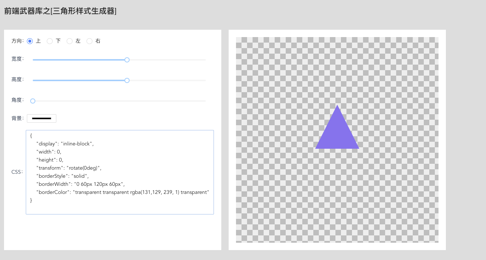

# css-triangle-generate

## 一个css 三角形样式生成器 使用vue.3.0 ant-design-vue 制作


## Project setup
```
yarn install
```

### Compiles and hot-reloads for development
```
npm run serve OR yarn serve
```

### Compiles and minifies for production
```
npm run build OR yarn build 
```

### Lints and fixes files
```
yarn lint
```

### Customize configuration
See [Configuration Reference](https://cli.vuejs.org/config/).
